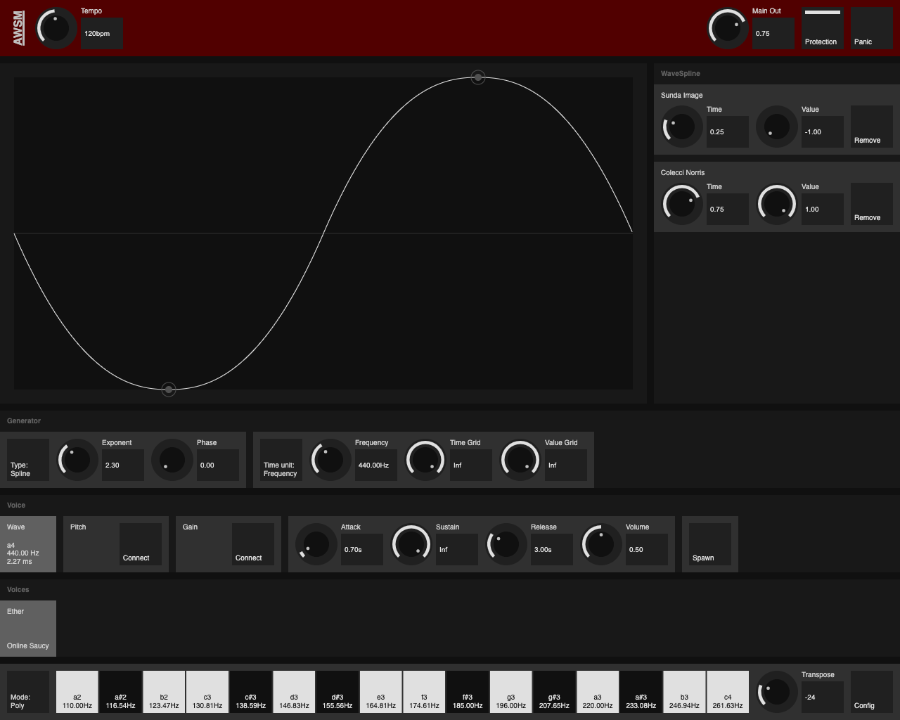
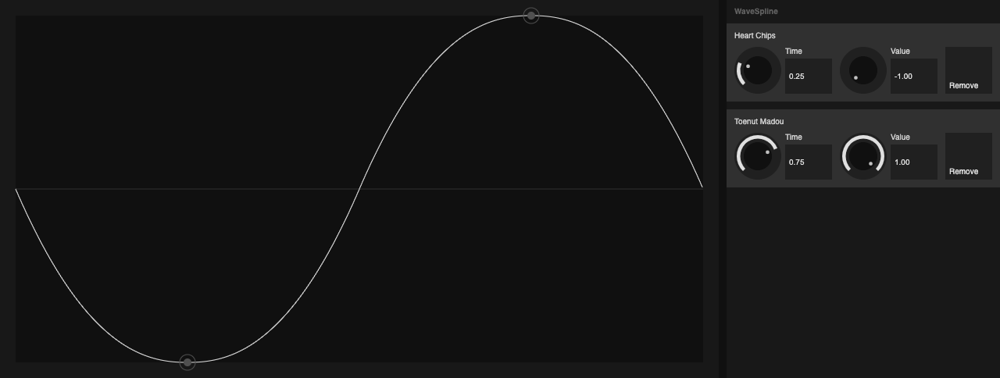
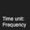
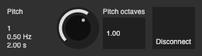
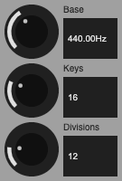

# AWSM
The *AwesomeWaveSplineMachine* is a software synthesizer that utilizes what I call dynamic *WaveSpline* synthesis. For the nerds, this is basically the interpretation of a set of temporal-ordered unitless time-value pairs as parametrically exponentially interpolated one-dimensional spline that you can manipulate in real-time while playback. 

I wonder if nobody came up with something like this, but I couldn't find anything directly related. I'm curious, let me know if you stumbled upon similar projects.

A screenshot of the *AwesomeWaveSplineMachine* in action. You can try it yourself, check the link below.


## Purpose
This is not a production-ready music instrument! Some key features are missing, likely there are some bugs, and you can expect audio clicks and glitches under certain conditions. It's a prototype, a proof of concept and my personal playground. But yes, you can make music with it.

## Try it out. It's free.

The *AwesomeWaveSplineMachine* runs in your Browser. Check out the link below.

The software is only tested on MacOS with Chrome and Firefox. In theory, it's cross platform. It probably won't work with outdated or esoteric browsers. 

It's designed to support touch interaction and should work on some mobile devices. At least I could run it on some Android devices. I haven't had the time to test this extensively, so expect some issues. I recommend using a desktop or laptop.

**Caution:** You can scrap your speakers with this tool. You can literally melt the coil. Use it at your own risk! Make sure that Protection is activated and that the Wave Generator waveform always crosses zero within a reasonable amount of time.

Click the link below to try the AWSM synthesizer in your browser. 

🚀 [AWSM - AwesomeWaveSplineMachine](https://rnd7.github.io/awsm/dist/index.html)

For more information consider one of the following links.

📚 [User Guide](#user-guide)

🏗 [Developer Guide](#developer-guide) 

🏛 [License](#license) 

Have fun, make noise, let me know what you think.


# User guide

[Back to top](#awsm)

The following is an overview of how to use the AwesomeWaveSplineMachine. For those who don't want to read this. Learning by doing should also work.

## Table of contents 

All the sections are listed top to bottom in the table of contents. Use the links to jump to a section.

| Link   | Description  |
|---|---|
|[Concept](#concept) | What I thought and how it works |
|[User Interface](#user-interface) | Overview of the user interface |
|[Header section](#header-section) | The header section provides access to global parameters and functions. |
|[WaveSpline section](#wavespline-section) | In the `WaveSpline` section you can edit the waveform of the selected `Generator`. Click and drag the `WaveSplineNodes` around, longpress to add a new one. Use the list view on the right to remove a node. |
|[Generator section](#generator-section) | A `Generator` is someting that outputs an signal, it does not have to be audible. The generator section shows the parameters of the selected `Generator` you can configure how the waveform is interpreted and played back.  |
|[Voice section](#voice-section)|Everything that can be played is a `Voice`. The voice section lets you configure all aspects of the selected `Voice` and lets you toggle between the `Generators`. Each `Voice` might utilize up to three `Generators`. Wave, Pitch and Gain. |
| [Voices section](#voices-section)| Use the voices section to toggle between `Voices`. You will find all voices that are currently played back in this section, and you might click kill to stop them. |
| [Keyboard section](#keyboard-section)|Use the keyboard to spawn new voices or to change the pitch of the active `Voice`. |
| [Mobile Devices](#mobile-devices)|In order to support small screen sizes the UI is responsive. The layout changes and some settings are relocated. |

---

## Concept

[Back to table of contents](#table-of-contents)

No sines, squares, triangles or sawtooths. I always liked the idea of manipulating the waveform directly. As mentioned this is not my first approach to this idea. I know it takes more than a fancy oscillator to make a synthesizer fun to play with, but that was the starting point.

I was thinking of something to create microtonal soundscapes, sustained clusters and evil bass sounds. That seems to be a suitable field of application for this form of synthesis.

Expect *AWSM* to work like a polyphonic drone synth. Therefore, although that is configurable, voices are sustained per default. You have to actively kill them.

Every single note that is played can be controlled individually. A Voice is accessible throughout its entire life cycle. The waveform and parameters of each Voice are independently configurable. The principle of having a discrete parametric preset as template for a instrument or a sound is softened. Voices float and evolve.

There is no filter section. For a similar effect you might want to try fiddling with the exponent settings or try moving around the WaveSplineNodes.

Time, amplitude, frequency, duration, wavelength, tempo, note value, measures, all the musical units are the same. That's not true, but these are tightly coupled. To account for this enlightenment WaveSplines are unitless and universal, might be quantized and are optionally bound to a master tempo. There is no distinction between VCO or LFO. The frequency range is just prevented from being zero and exceeding the upper end of the audible spectrum. 

I like the principle of rhythmic sequencing without notes or steps. Similar to some modular synths, simple sequences can be created using a gain WaveSpline. Each voice can alsp be melodically sequenced using a seperate pitch WaveSpline, roughly comparable to what an arpeggiator does.

While I understand the principle of the octave as somehow universal, the common subdivisions seem to be a wise choice, but not without alternatives. Why not try to divide it by five. The virtual keyboard can be configured accordingly. I also already mentioned mircotonality,

---

## User interface

[Back to table of contents](#table-of-contents)

This is a screenshot of default state of the user interface. Basically what you see when you start the application. Naming is random and will vary. The application is quite consistent regarding its user interface, so what you see is almost everything you have to deal with. The user interface elements are grouped into different sections. Except for the header and the keyboard these are labeled on the bottom right corner. You will find the corresponding section in the table of content.





---

## Header section  
[Back to table of contents](#table-of-contents)

You find some global settings in the header section.


### Tempo
Within the `WaveSpline View` section you choose a `Time unit`. All units other than `Frequency` are bound to the global `Tempo` value.


### Main Out
Global mix output volume value. All Wave Generator outputs are mixed and multiplied with the `Main Out` value.


### Protection
If active the audio output is muted if no zero crossing occurs within a period of 10 seconds. The indicator will start to blink in this case. As soon as a the audio signal crosses zero again the output is continued. I strongly suggest not disabling this feature, but you can by clicking the toggle. The image shows the toggle in its active state.


### Panic
Releases all voices. `Release` values are still taken into account.


---

## WaveSpline section 
[Back to table of contents](#table-of-contents)


Within this section you can modify the waveforms by dragging the `WaveSplineNodes` around on the canvas or using the rotary controllers in the `WaveSplineNode` list.




### WaveSpline canvas
`Click` to select the closest `WaveSplineNode` on the canvas. Drag nodes to modify the waveform. Use `Longpress` to add new nodes at the pointer position. The canvas shows always the `WaveSpline` of the currently selected `Generator` within the active `Voice`.

The currently selected `WaveSplineNode`is highlighted.


Removal of a `WaveSplineNode` is currently only possible by clicking on the remove button in the list view.

### WaveSplineNode list
Just a different view of the `WaveSplineNodes` shown on the canvas. Use this to manually input `WaveSplineNode` values. The entries are sorted according to the position on the canvas.

The currently selected `WaveSplineNode` is highlighted.


### WaveSplineNode
There are two types of `WaveSplineNodes` depending on the type chosen in the WaveSpline Settings section.

If the type of the `WaveSpline` is `Spline` or `Step`.


When the `WaveSpline` type is `Nodes`.


### Time
The temporal position of the `WaveSplineNode` within the waveform. The same as dragging a node from left to right on the canvas.


### Value
The value of the `WaveSplineNode` within the waveform at the given time. This can either be the amplitude or the pitch and is the same as dragging a node up or down.


### Exponent
Only applies for `WaveSplines` of type `Nodes`. Use it to choose the righthand exponent individually per `WaveSplineNode`. Choose a value of 1 for linear interpolation.


### Remove
Delete a `WaveSplineNode`.


---

## Generator section 
[Back to table of contents](#table-of-contents)

Configure how the `WaveSpline` is interpreted. Always shows the values of the selected `Generator` within the active `Voice`


### WaveSplineSettings
Change `WaveSpline` specific values. Depending on the selected `WaveSpline` type the view differs.

Generator Settings for `WaveSpline` of type `Spline`


WaveSpline Settings for `WaveSpline` of type `Nodes` or `Step`.


### Type
`Click` to open a modal. Choose between three different types of WaveSpline. `Spline` uses exponential interpolation. All nodes share the same exponent value. `Nodes` is basically the same as `Spline` but with individual exponent settings per Node. `Step` does not interpolate between the nodes, useful to create pitch sequences for example, not particular suitable for audio output.


The modal that opens up next to the button will look like this. The currently selected type is highlighted.


### Exponent
Only applicable for `WaveSplines` of type `Spline`. Sets the exponent used by all nodes of the `WaveSpline`. A value of 1 equals linear Interpolation, a value around 2 is similar to a sine wave. Values lower than 1 produce spikes, higher values tend towards a square wave.


### Phase
Shift the phase of the `WaveSpline`. Useful to carefully align the waveforms of multiple voices.


### WaveSplineView
`WaveSplines` are unitless, so the view determines the way it is rendered as audio, pitch or gain signal. 

The view when Time Grid value is zero which equals infinity, which means no raster.


When using a non zero Time Grid value.


### Time Unit
The Time Unit changes the input method of the Timing control. You can choose between `Frequency`, `Common`, `Note` and `Measure` depending on your preferences. Note that only `Frequency` is independent from the global `Tempo`, while all other options are bound to it and will be scaled when changing the value.



The modal that pops up lets you select the desired value. The current selection is highlighted.


### Frequency
Depending on the selected Time Unit the control changes to allow the manual input of a frequency respectively a note values. The keyboard section changes the frequency value of the `Wave` generator within the active `Voice`.

This is the input if the selected Time Unit is `Frequency`. Select a frequency. This is the only value that is not bound to the global `Tempo`.


This is the input if the selected Time Unit is `Common`. Choose from common musical rhytm values. Bound to global `Tempo`.


This is the input if the selected Time Unit is `Note`. Choose a fraction. Bound to global `Tempo`.


This is the input if the selected Time Unit is `Measures`. Duration in Bars. Bound to global `Tempo`.


### Time Grid
Quantize time. Define the subdivisions per `WaveSpline` cycle. A value of zero turns of temporal quantization. Primarily to create Pitch sequences. In theory also acts as sample rate converter for audible signals.


### Time Offset
Only visible for non zero Time Grids. Use this to shift the quantized `WaveSpline` left and right. Useful to carefully align the pitch waveform of multiple voices.


### Value Grid
Quantize value. A value of zero turns of value quantization. Useful if you want pitch steps for example. Acts like a bitrate reducer when applied to a `Wave` Generator. 


---

## Voice section  
[Back to table of contents](#table-of-contents)

The currently selected voice can be configured in this section. You can manage the generators and parametes of the envelope for example.


### Wave Generator
`Click` to select the Wave Generator and display the according `WaveSpline`. The Wave Generator cannot be removed.

The Wave Generator is used to generate the audio output. Both Pitch and Gain Generators can be connected to modify its parameters.

Especially if you decide to disable `Protection` be sure that the `WaveSpline` crosses zero and the frequencies are not too low in order to prevent damaging your speakers.

The Wave Generator is selected by default. This is what it looks like in its highlighted state.


### Pitch Generator
`Click` to select the Pitch Generator. The Pitch generator is optional and not connected per default. The view changes as soon as the Generator is connected.

Primary use is melodic sequencing. Might also be used for frequency modulation.

View when not connected.


View when connected.



### Pitch Connect
Click to create and connect a new WaveSpline Generator that changes the pitch of the Wave Generator of the selected Voice.


### Pitch Disconnect
Only visible when connected. Click to disconnect and remove the Pitch Generator of the selected Voice.


### Pitch octaves
A multiplier that determines how much octaves the Pitch Generator covers. Negative values reverse the pitch direction.


### Gain Generator
Click to select the Gain Generator. The Gain generator is optional and not connected per default. The view changes as soon as the Generator is connected.

Use this to add rhytm or for amplitude modulation purposes.


View when not connected


View when connected


### Gain Connect
Click to create and connect a new WaveSpline Generator that affects the amplitude of the Wave Generator within the selected Voice.


### Gain Disconnect
Only visible when connected. Click to disconnect and remove the Pitch Generator of the selected Voice.


### Voice Settings
Configure the envelope and the mix volume of the selected voice.


### Attack
Attack time. Time it takes to reach the volume when a voice is spawned or revived.


### Sustain
Sustain Time. Per default the Sustain time is infinite. If you choose a value the voice is automatically killed after the given time. The sustain period starts after the Attack time, or whenever the sustain value is changed.


### Release
The time a voice is faded out after being killed. Also applies when the Panic button is pressed.


### Volume
Additonally to the Gain generator and the envelope setting the Volume value is finally multiplied with the Wave Generator output. Use this to change overall Volume per Voice.


### Spawn
Click this button to spawn a new Voice by cloning the values of the currently selected voice. You want to choose this method, if you do not want to change the configured Wave Generator frequency as it happens when you press a keyboard key.


---

## Voices section 
[Back to table of contents](#table-of-contents)

A `Voice` has a life cycle, and within this section you can manage it. The currently selected `Voice` is highlighted. Using the `Keyboard` or by clicking the `Spawn` button you create a clone that immediately appears in this section. Each `Voice` can be modified individually as long as it is played back.

Voices contain the `Wave` generator and optional `Pitch` and `Gain` generators. Select a `Generator` by clicking on it.

Since Voices are sustained by default you might end up with a bunch of voices while playing on the keyboard. Either choose a `Sustain` time, `Kill` Voices manually or click the `Panic` button to get rid of them all.

The `Ether` is the default `Voice` and acts as template to spawn new voices. The `Grave` holds the last `Voice` that died while being selected. Everything you hear is listed right of the grave in the audible voices section.


### Ether
Click to select the `Voice` from the `Ether`. Basically a non audible `Voice` that acts as default template. Select this, if you want to configure a voice before it is played. After configuring you can play the voice using the Keyboard or the Spawn button. 

The `Ether` never changes unintentionally. 

In this graphics is the selected state of the `Ether` as you find it when starting the application.


### Grave
Similar to the `Ether` the `Voice` in the `Grave` is non audible. Everytime a selected `Voice` is killed and died, either manually or by reaching its `Sustain` time, it ends up in the `Grave`. Use it to respawn a Voice that died.


### Audible Voices
All voices that are currently active and produce some audio signal are listed here.


### Audible Voice
Click to select the `Voice`. The view changes to display the selected `Voice`. Basically the same as the `Ether` and `Grave` Voices, but currently active and presumably producing some audio output.

Every Voice has an Attack, Hold and Release state.

Audible `Voice` while living


Audible `Voice` when killed


### Audible Voice Kill
As soon as you click the kill button the `Voice` is released and the view changes. After the `Release` time the `Voice` is removed from the audible voices section. If it was selected while being removed it will show up in the `Grave`, otherwise it is gone.


### Audible Voice Revive
During the Release Phase you have the opportunity to Revive a Voice. The Voice state changes to Attack, the voice is faded in again.


---

## Keyboard section
[Back to table of contents](#table-of-contents)


### Mode
You might choose from two different Keyboard Modes. `Poly` will spawn a new Voice everytime you press a Keyboard Key. `Mono` will only spawn on Voice but keep setting the Wave Generator frequency of the selected Voice. You might use the `Mono` mode to change the frequency of any Voice selected using the Keyboard.


The following modal pops up when clicking the select button. In this case `Poly` is selected.


### Keyboard
Somehow self explaining, I guess. Depending on the selected Mode a new Voice is spawned using the currently selected as template or, when in `Mono` Mode, the Wave Generator frequency is changed according to the key pressed.

The frequency of the Wave Generator of the currently selected voice is highlighted. In this example c3.


### Transpose
Shifts the Keyboard range octace wise.


### Config
Opens up the Keyboard Config Panel to configure the virtual Keyboard.


### Keyboard Config Panel
The Keyboard Config Panel opens up when clicking the config button. 




### Keyboard Config Panel Base
Base frequency from which the Key frequencies are calculated from


### Keyboard Config Panel Keys
Amount of keyboard keys to display.


### Keyboard Config Panel Divisions
Number of subdivisions per octave.


---

## Mobile devices
[Back to table of contents](#table-of-contents)

Mobile device support is limited. I guess it will work on some devices. On small screens the layout changes. Instead of a list of all `WaveSplineNodes` you only see the currently selected `WaveSplineNode` below the canvas. You can scroll through the different sections, the position of the header and the keyboard section stays fixed.

### Landscape
I recommend choosing landscape orientation, since the most important features are better accessible. You can scroll down to view the other sections.


### Portrait
While you still can use the application in portrait orientation, I have to admit it does not look beautiful. The header settings are relocated into the `Settings` modal and you probably want to reduce the number of keyboard keys in the `Keyboard Config Panel` to make it easier to use them. 


# Developer guide

[Back to top](#awsm)

## Motivation

It was curiosity and the joy in developing software that serves as a tool for creative expression. When I read about the AudioWorklet replacing the ScriptProcessorNode I was excited to try out this new technology. It overcomes the perfomance limitations of the previous approach, perhaps finally sophisticated real-time audio in the browser. I wanted to give it a try. It seemed to be the time for what is now the third revision of a synthesizer, where you can edit the waveform similar to a curve in a vector graphics program.

## Technology

The *AWSM* is raw web technology, a pure vanilla shake, no 3rd party libs used. No dependencies other than a modern browser environment. 

In theory it does not require a build step utilizing a bundler or transpiler. I cried a while when realizing that Firefox currently does not support ES6 module imports within AudioWorklets. It's a shame and I hope this will change some day. For now I had no better idea to resolve and bundle all imports of this component using webpack, the rest of the app stays untouched and is just copied to the dist folder. For development I use Chrome and a dev server that serves directly from the src directory, no need to wait for a build to complete.

Essentially, there are three distinct loosely coupled development realms. The data model and the interpolation logic, the sound generation and the user interface.

The data model is somewhat old-fashioned. It is an event-driven, object-oriented approach with mutable types and cross referencing support. Maybe I'm wrong, but IMAO this seemed appropriate, flexible and performant.

The sound generation is almost exclusively realized using a monolithic AudioWorklet as oscillator. The processing is done using ECMA script only. The performance can certainly be significantly improved if this part is implemented as a WASM module.

The user interface is built exclusively on Web Components technology. All elements are custom made and the components are coupled to the model via an propietary event system.

I like to utilize my free time projects to deepen my knowledge and try out new stuff. Both things that are often hard to justify when working at a regular basis and for a paying customer. Do not consider anything of the code as best practice, as long as you are not convinced it is.

## State of development
This is a protoype, a technology demonstrator, nothing stable.

Nevertheless I put quite a lot of effort into this. Everything was built from scratch. It took me over hundred hours to get this project to where it is today. Uncounted the hours I was lost in creating sounds and music with this tool. 

For now no further development is planned. Even if I'd love to try out some more ideas and integrate a bunch of further features, I do not have the time to do so. Maybe I'll mess around with this some time in the future. Don't expect anything to stay or change.

I think some crucial features are missing. The list is long, but here are a few of the features I would love to add.

- ~~Speaker Protection~~
- ~~Improve support for smartphones and other small screen size devices~~
- Selection and transformation of multiple WaveSplineNodes at once
- Local storage of multiple configurations using IndexedDB API
- WaveSplineProcessor WASM implementation
- Referencing option when connecting generators
- WaveSpline referencing
- Implement more interpolation algorithms
- MIDI support
- Stereo panning for Voices
- Automate everything
- Electron wrapper

## Exponential WaveSpline Algorithm
At its core it's just a simple algorithm. The general concept would also work with linear interpolation, but exponential interpolation sounds so much smoother. Modifying the exponent in realtime changes the curve steepness dynamically somehow similar to what a filter does.

The exponential interpolation algorithm outputs y for x that always stays within the given min / max boundaries of a 2d point set. 

The interpolation curve is calculate by combining two segments of two x to n degree exponetial functions where x > 0.   

This is a simplified example. The curves are actually scaled, moved and limited.

First function 
```
-x^2                       
 
            |                
   -------x-a-a--------     
        x   |   a           
      x     |     a         
     x      |      a         
    x       |       a         
```
Second function
```
x^2

    b       |       x
     b      |      x
      b     |     x
        b   |   x 
   -------b-b-x--------
            | 
```
Combined interpolation curve
```
   a  a
   |     a
   |       a 
   |        a
   |         a
   |          b
   |           b
   |            b
   |              b
   +-----------------b--b 
```

Pseudo code algorithm including transformation
``` 
if x < .5
    f(x) = ((x * 2) ^ e) / 2   
else
    f2(x) = 1 - ((1-x) * 2) ^ e) / 2
```
## Audio Processing
The audio processing is decoupled from the rest of the application. The AudioCore manages the playback and state of all audible Voices. Every voice contains a Wave generator that has a optional pitch and gain input that can be connected to the output of another generator. 

The user interface does not support it, but Generators can be reused by multiple voices. This applies to almost all data model classes. Even WaveSplineNodes could be used in multiple WaveSplines. You always have the choice of just referencing something.

The AudioCore manages the Voices, and the VoiceInterface retrieves all necessary WaveSplineProcessors from a global processor pool. Processors are created on demand and automatically garbage collected using simple reference counting.


## Audio Routing
The *AWSM* produces only a mono output signal the same signal is copied to all channels. The routing is quite straight forward. Note that even if the UI does not allow it, it is possible to use the output of any generator as input parameter for one or more other generators. Pitch and gain generators are optional.
```
pitch generator => wave generator pitch param
gain generator => wave generator gain param
wave generator => ASR / volume
ASR / volume => voice out
voice out => mix
mix => protection
protection => main out
```

## User Interface Component Hierarchy
The user interface largely consists of WebComponents. Abstract, simpler units are called elements, more complex, application-specific ones are reffered to as components.

The component structure of the user interface.

```
AWSM
    HeaderSection
    WaveSplineSection
        WaveSplineCanvas
        WaveSplineNodeList
            [WaveSplineNodeListItem]
        WaveSplineSettings
        WaveSplineViewSettings
    VoiceSection
        VoiceWaveGenerator
        VoicePitchGenerator
        VoiceGainGenerator
        VoiceSettings
        [VoiceListItem]
    KeyboardSection
        KeyboardSectionSettingsModal
```


## Data Model
The main components of the data model are as follows.
```    
Configuration
    voices: [Voice]

Voice
    attack, sustain, release, volume
    wave: Generator
    pitch: Generator
    gain: Generator

Generator
    waveSpline: WaveSpline
    waveSplineView: WaveSplineView

WaveSpline
    type, phase, e
    nodes: [WaveSplineNode]

WaveSplineNode
    x, y, e

WaveSplineView
    frequency, quantizeX, quantizeXThreshold, quantizeY

```


# License

[Back to top](#awsm)

Feel free to use this tool to make music or to test the limits of your speakers. I encourage this. When redistributing the software, be sure to understand the underlying license. Since I'm donating a considerable amount of my time to the opensource community, it's important to me that everything that builds on this is also available to everyone.


This project is licensed under the GNU General Public License v3.0

Copyright (C) 2022  C. Nicholas Schreiber

See [COPYING](https://rnd7.github.io/awsm/COPYING) for the license text or contact me for more information.

The license applies to every file within this repository even if not explicitly stated within the source code of every module.

Official GNU license page: [GNU General Public License v3.0](https://www.gnu.org/licenses/gpl-3.0.html)
